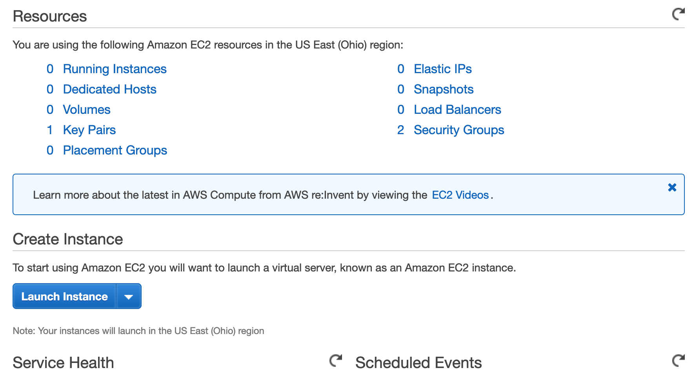
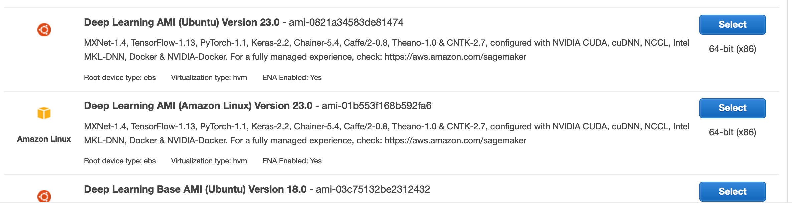
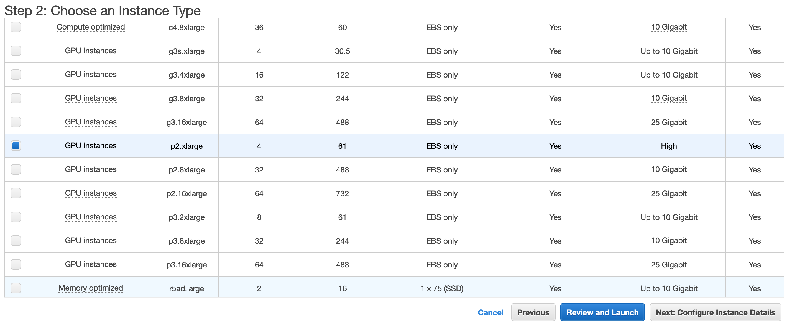

# AWSModelTraining
[Video Tutorial by Code Emporium](https://www.youtube.com/watch?v=pK-LYoRwp-k)

A Resource on how to create, load, and use an AWS EC2 Instance to train a model. 

- Go to https://aws.amazon.com/ to sign up for an Amazon Webservice Account, or sign in to the console.

- Once at the AWS Management Console type EC2 in the search bar, or click on EC2 if that option is available. 

- To left of Resources click on Limits

- Navigate to "Running On-Demand p2." instances. These are your GPU instances.

- If you have 0 for your current limit for the p instances, then you will need to click "Request a Limit Increase". I increased my limit on the p2.xlarge instance, but you can choose any of the p and some other instances if you need to train on a GPU. The p2.xlarge instance is $1 USD an hour, other pricing can be found [here](https://aws.amazon.com/ec2/pricing/on-demand/). Increasing your EC2 limit may take a day or two. 

- Assuming you have access to the GPU EC2 instances now, you can create an instance. Look up EC2 on your the AWS Management Console.

- Click on the launch instances button. 

- Select your operating system. The best choice is the "Deep Learning AMI" which includes several Deep learning framworks. 

- Now navigate to the instance you want to use and click the box to the left. Now click review and launch.

- Click launch. 

- Once you click launch a dialogue box will pop up asking for a key pair. Name it whatever you like, and click "Download Key Pair". Afterwards click "Launch Instance", and then click "View Instance" in the next page. 

- 
