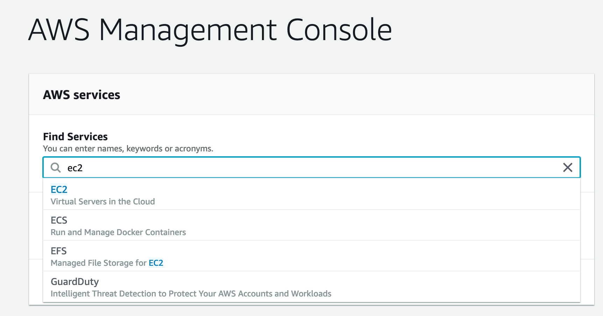
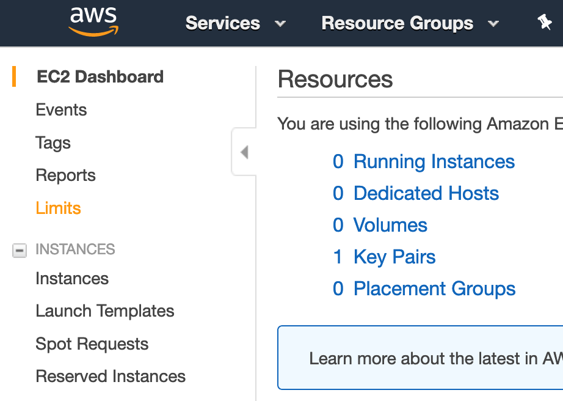
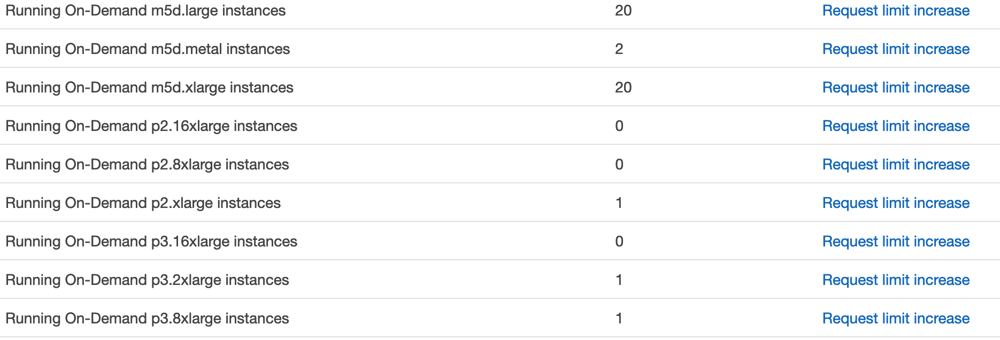
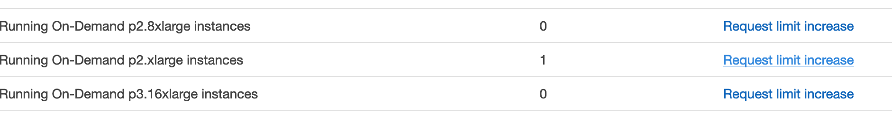

# AWSModelTraining
[Video Tutorial by Code Emporium](https://www.youtube.com/watch?v=pK-LYoRwp-k)

A Resource on how to create, load, and use an AWS EC2 Instance to train a model. 

- Go to https://aws.amazon.com/ to sign up for an Amazon Webservice Account, or sign in to the console.

- Once at the home page type EC2 in the search bar, or click on it if that option is available. 

- To left of Resources click on Limits

- Navigate to "Running On-Demand p." instances. These are your GPU instances.

- If you have 0 for your current limit for the p instances, then you will need to click "Request a Limit Increase". I increased my limit on the p2.xlarge instance, but you can choose any of the p and some other instances if you need to train on a GPU. The p2.xlarge instance is $1 USD an hour, other pricing can be found [here](https://aws.amazon.com/ec2/pricing/on-demand/).

