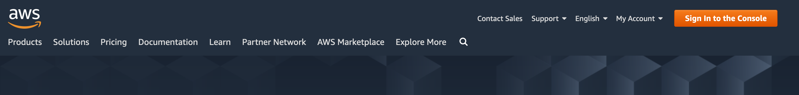
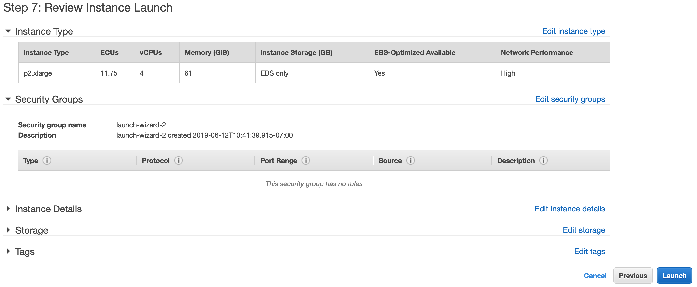
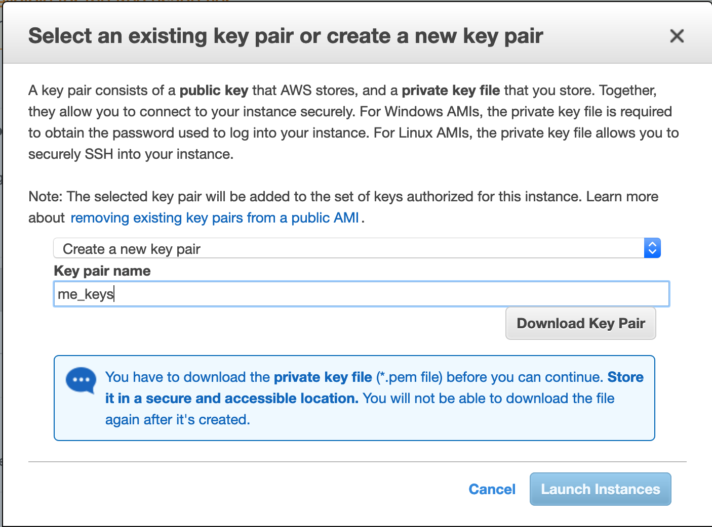
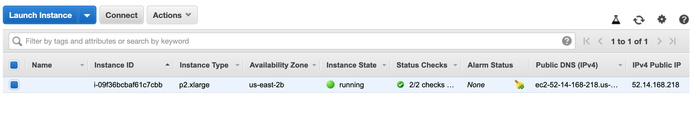
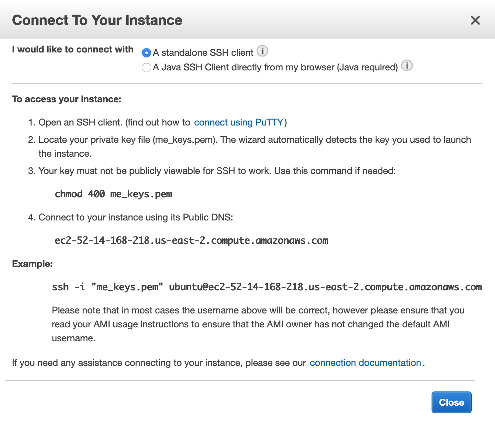
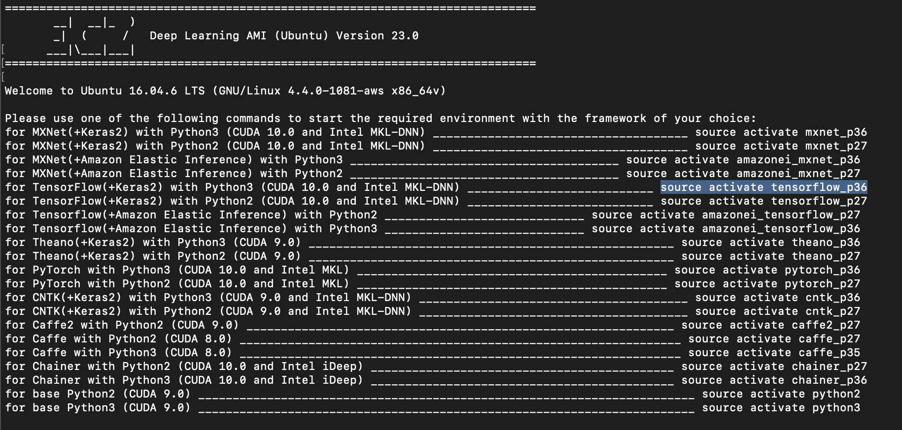

# AWSModelTraining
[Video Tutorial by Code Emporium](https://www.youtube.com/watch?v=pK-LYoRwp-k)

A Resource on how to create, load, and use an AWS EC2 Instance to train a model. 

- Go to https://aws.amazon.com/ to sign up for an Amazon Webservice Account, or sign in to the console.

- Once at the AWS Management Console type EC2 in the search bar, or click on EC2 if that option is available. 

- To left of Resources click on Limits

- Navigate to "Running On-Demand p2." instances. These are your GPU instances.

- If you have 0 for your current limit for the p instances, then you will need to click "Request a Limit Increase". I increased my limit on the p2.xlarge instance, but you can choose any of the p and some other instances if you need to train on a GPU. The p2.xlarge instance is $1 USD an hour, other pricing can be found [here](https://aws.amazon.com/ec2/pricing/on-demand/). Increasing your EC2 limit may take a day or two. 

- Assuming you have access to the GPU EC2 instances now, you can create an instance. Look up EC2 on your the AWS Management Console.

- Click on the launch instances button. 

- Select your operating system. The best choice is the "Deep Learning AMI" which includes several Deep learning framworks. 

- Now navigate to the instance you want to use and click the box to the left. Now click review and launch.

- Click launch. 

- Once you click launch a dialogue box will pop up asking for a key pair. Name it whatever you like, and click "Download Key Pair". Afterwards click "Launch Instance", and then click "View Instance" in the next page. 

- Your instance will take a moment to launch, as soon as it has launched select your instance and click on the "Connect" button.

- Follow the instructions in the pop up dialogue box to connect to your EC2 instance through ssh. 

- Once you have entered these commands in the terminal (From the directory containing your pem file) activate one of the environments you want to use. 

You are now in your EC2 instance! 

- To load files into your EC2 instance use SCP as below, with -r being used to upload a folder and removed when there is only a single file to upload: 

`scp -i "my_key_name.pem" -r "file/folder"  user@amazonUrl:~/directory_name/`

Now your files will upload, and you can find your data in the home directory of the EC2 instance. From here on out you can run code in the ec2 instance after navigating to the proper directory. 

- To download your files, type the below code: 

`scp -i "my_key_name.pem" -r user@amazonUrl:~/directory_name/ ~/Download/`

To find out about running a training session that won't be interupted by messing with your ssh connection check out this thread: https://stackoverflow.com/questions/25122172/how-to-run-script-on-amazon-ec2-without-keeping-an-ssh-pipe-open

But in short run: 
`nohup yourCommand &` 
